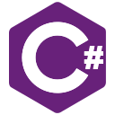
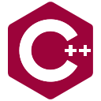

# About
- I convert tea into code
- I use these languages 
    
    
    
    
    
    
  - Click on the icon to show repositories filtered by language
  - Icons are not in any particular order

# GitHub Metrics 

> Most of them are updated once a week.

<!--
base is 480x223 and calender is 480x342
to make equal height, base width becomes 736
therefore, base takes 736 / (736 + 480) = 60.53% of width
then take out 0.5% for a gap
-->

	
<b>Overview</b>

	
	

<!--
tl;dr
(h1,h2,w2) => {
	const w1 = h2 / h1 * w2;
	const t = w1 + w2;
	return {
		width1: ((w1/t-0.005)*100).toFixed(2)+'%',
		width2: ((w2/t-0.005)*100).toFixed(2)+'%',
	}
}
-->

	
<b>Languages & Activity</b>

	<!-- lang: 480x284 -->
	<!-- act: 480x356 -->
	
	
	<blockquote>Most Used Languages does not reflect coding experience or skill level</blockquote>

	
<b>Achievements</b>

	

    
<b>Contribution Graph</b>

    

> For more statistics, see [profile-summary-for-github.com](https://profile-summary-for-github.com/user/floaterest)
